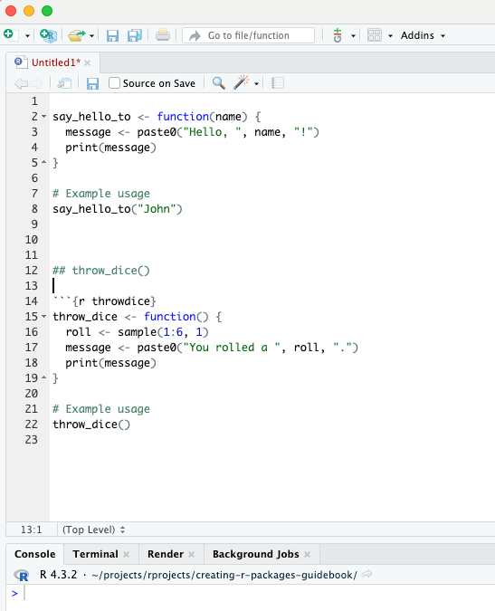
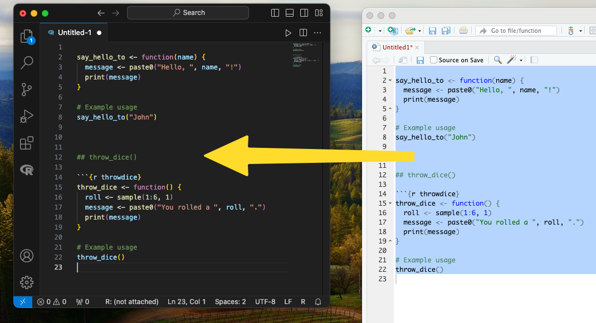

# Writing Basic Functions

In this chapter, we'll start by writing a couple of simple functions. These functions will be used later on in the R package we are creating.

Below is a screenshot of writing these functions in RStudio. Further down on this page, you will find the code in a text format, which you can copy and paste into your editor.

\




## Example function 1

The `say_hello_to()` function takes one argument, a name, and prints a greeting message.

```{r sayhelloto}

say_hello_to <- function(name) {
  message <- paste0("Hello, ", name, "!")
  print(message)
}

# Example usage
say_hello_to("John")

```


## Example function 2

The throw_dice() function simulates rolling a six-sided die. It generates a random number between 1 and 6 and prints the result.

```{r throwdice}
throw_dice <- function() {
  roll <- sample(1:6, 1)
  message <- paste0("You rolled a ", roll, ".")
  print(message)
}

# Example usage
throw_dice()

```


## Saving Your Code

After writing these functions and testing them in an R environment like RStudio, make sure to save or copy-paste them somewhere. This way, you can introduce them to your R package once we progress further in this tutorial.

In this example, I copied the functions to Visual Studio Code (as shown in the screenshot below), but you can use any text editor, such as TextEdit on MacOS or Notepad on Windows, or simply save the code somewhere on your computer.

\




\

\

\


 <p xmlns:cc="http://creativecommons.org/ns#" xmlns:dct="http://purl.org/dc/terms/"><a property="dct:title" rel="cc:attributionURL" href="https://creating-r-packages.netlify.app">Creating R Packages: A Step-by-Step Guide</a> by <a rel="cc:attributionURL dct:creator" property="cc:attributionName" href="https://www.linkedin.com/in/ville-langen/">Ville Langén</a> is licensed under <a href="https://creativecommons.org/licenses/by-sa/4.0/?ref=chooser-v1" target="_blank" rel="license noopener noreferrer" style="display:inline-block;">CC BY-SA 4.0</a></p> 
 