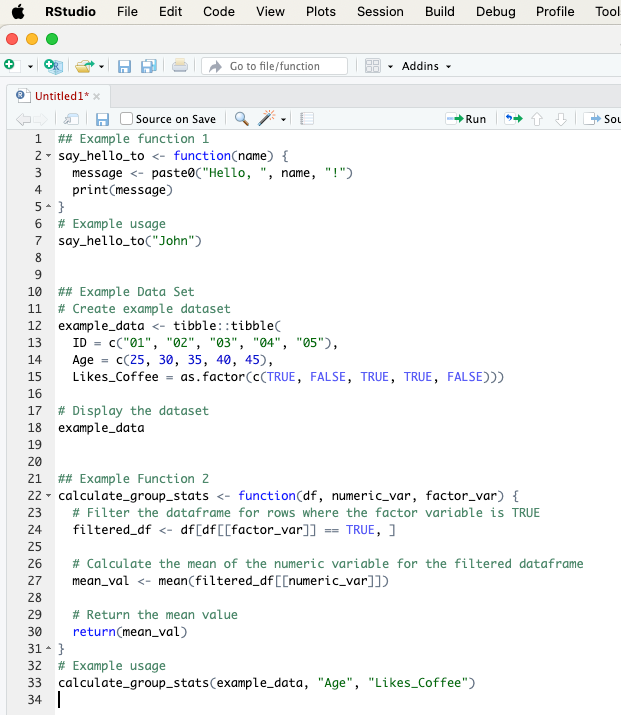
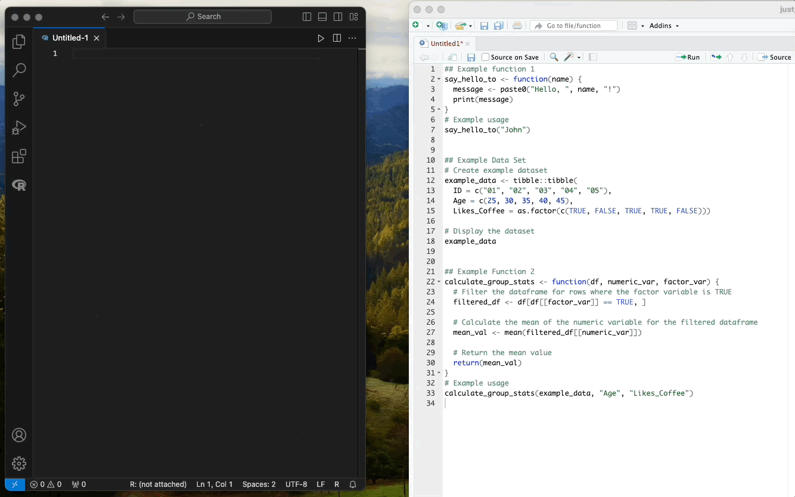

# Creating Functions and Datasets

In this chapter, we'll create a couple of simple functions and an example dataframe.

Below is a screenshot of writing these functions in RStudio. Further down on this page, you will find the codes in a text format, which you can copy and paste into your editor.

\




## Example function 1

The `say_hello_to()` function takes one argument, a name, and prints a greeting message.

```{r sayhelloto}

say_hello_to <- function(name) {
  message <- paste0("Hello, ", name, "!")
  print(message)
}

# Example usage
say_hello_to("John")

```


## Example Data Set

In addition to functions, it's often helpful to include example datasets in your package to demonstrate how your functions can be used. We'll now create a small example dataset called example_data and add it to our package.


```{r exampledata}

# Create example dataset
example_data <- tibble::tibble(
  ID = c("01", "02", "03", "04", "05"),
  Age = c(25, 30, 35, 40, 45),
  Likes_Coffee = as.factor(c(TRUE, FALSE, TRUE, TRUE, FALSE)))

# Display the dataset
example_data

```

 

## Example Function 2

This function calculates the mean of a numeric variable (like age) for rows where another variable (like 'Likes_Coffee') has the value TRUE. In our example dataset, it can be used to find the mean age of people who like coffee.


```{r groupstats}

calculate_group_stats <- function(df, numeric_var, factor_var) {
  # Filter the dataframe for rows where the factor variable is TRUE
  filtered_df <- df[df[[factor_var]] == TRUE, ]
  
  # Calculate the mean of the numeric variable for the filtered dataframe
  mean_val <- mean(filtered_df[[numeric_var]])
  
  # Return the mean value
  return(mean_val)
}

# Example usage
calculate_group_stats(example_data, "Age", "Likes_Coffee")


```


## Saving Your Code

After writing these functions and testing them in an R environment like RStudio, make sure to save or copy-paste them somewhere. This way, you can introduce them to your R package once we progress further in this tutorial.

In this example, I copied the functions to Visual Studio Code (as shown in the screenshot below), but you can use any text editor, such as TextEdit on MacOS or Notepad on Windows, or simply save the code somewhere on your computer.

\




\

\

\


 <p xmlns:cc="http://creativecommons.org/ns#" xmlns:dct="http://purl.org/dc/terms/"><a property="dct:title" rel="cc:attributionURL" href="https://creating-r-packages.netlify.app">Creating R Packages: A Step-by-Step Guide</a> by <a rel="cc:attributionURL dct:creator" property="cc:attributionName" href="https://www.linkedin.com/in/ville-langen/">Ville Langén</a> is licensed under <a href="https://creativecommons.org/licenses/by-sa/4.0/?ref=chooser-v1" target="_blank" rel="license noopener noreferrer" style="display:inline-block;">CC BY-SA 4.0</a></p> 
 