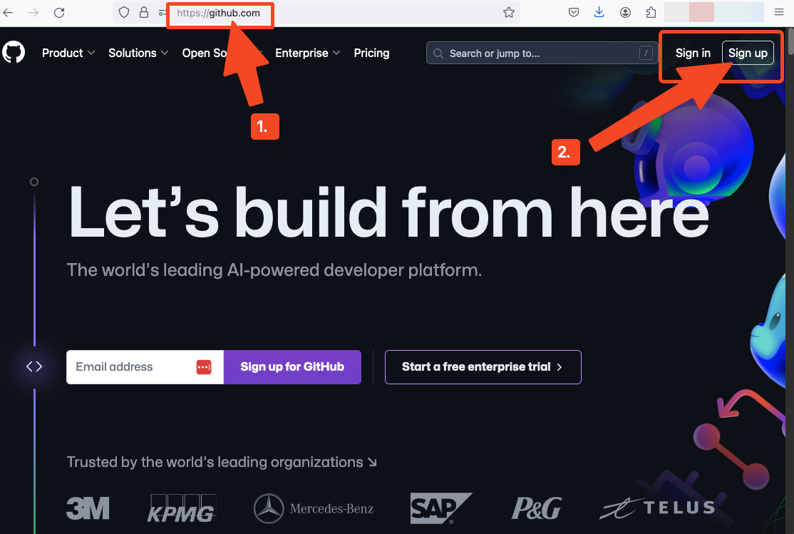
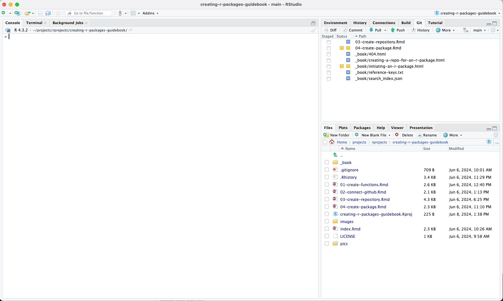
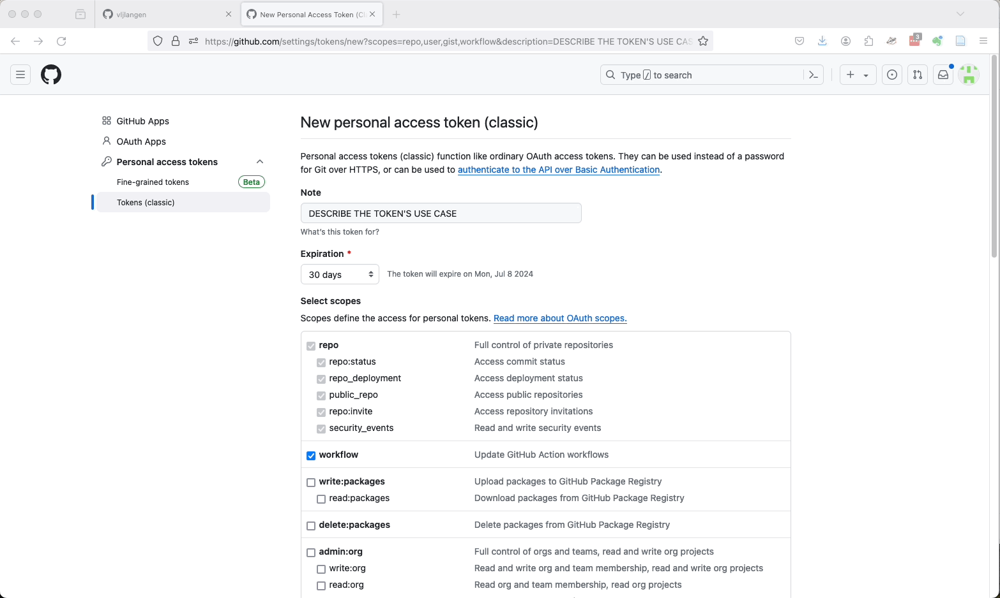
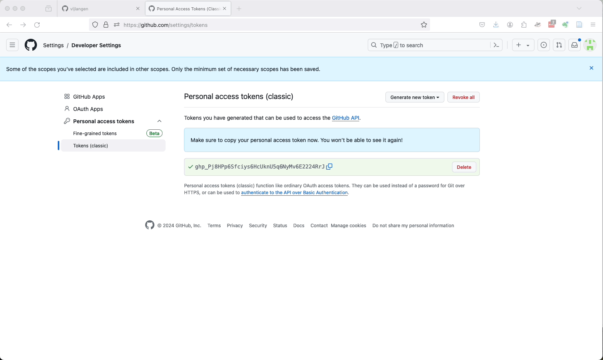

# Setting Up Git and GitHub

For distributing your package to your friends or colleagues and for
backup purposes, it is always advisable to push your package to a code
repository. In this tutorial, we will use the **GitHub** service and set up
a secure connection between it and your computer using a **Personal Access
Token (PAT)**. If you already have this set up, you can jump right to the
next chapter. If you already have an SSH connection set up between your computer and GitHub, you can still set up a connection using a PAT. So, read on.

And particularly if you didn't grasp much of what was mentioned above, please continue reading.

## Installing Git

First of all, ensure that Git is installed on your computer.

If you are on Mac, you're all set, as Git comes pre-installed. However, if you're on Windows and don't have Git installed yet, head to the following webpage to download and install it (preferably with default settings):

[Download Git for Windows](https://git-scm.com/)


## Tell Git your credentials

If you've already configured your name and email in Git, you can skip this part and jump to the subheader "Signing up for GitHub".

### On Mac

- Press ```Command``` (or ```Cmd```) button and ```spacebar``` button simultaneously
- A Spotlight Search pops up
- Write: ```terminal```
  - You don't usually have to write more than a couple of letters, and already then your computer suggests the application Terminal, and you can just press enter to make it launch


Terminal launches. Run the following lines of codes on it (replace your credentials to the lines below):

```
git config --global user.name "Your Name"
```

```
git config --global user.email "youremail@example.com"
```

You may now close the Terminal.


### On Windows

- Press the ```Windows Key``` + ```R``` on your keyboard
- Type ```CMD``` and press enter
- Type ```git-bash.exe```

If this does not work, do the following:

- Press the ```Windows Key``` + ```R``` on your keyboard
- Type ```Git Bash``` and press enter

A Unix-kind of shell should launch. Run the following lines of codes on it (replace your credentials to the lines below):

```
git config --global user.name "Your Name"
```

```
git config --global user.email "youremail@example.com"
```

You may now close the Git Bash.


## Signing Up for GitHub

If you don't have a GitHub account yet, you'll need to sign up for one.
Follow these steps:

1.  Go to [GitHub](https://github.com/) and click on "Sign up" in the
    top right corner.
2.  Follow the on-screen instructions to create your account. Note that
    GitHub now uses Two-Factor Authentication (2FA) for added security,
    so you will need to set this up during the registration process.

\



\
\

[***After signing up or signing in to GitHub, do not sign
out!***]{style="color: red;"}

\

Because in the next step, the user needs to be signed in to GitHub as we
will create a Personal Access Token (PAT) from within RStudio.

\
\

## Personal Access Token (PAT)

We will now set up a Personal Access Token (PAT) which will be used to
authenticate your actions on GitHub.

As mentioned earlier, if you already have a connection established with
a PAT between your computer and GitHub, you can skip over this section
and proceed to the next chapter.

### Creating a PAT in R

Open your R console and run the following command to create a GitHub
token:

``` r
usethis::create_github_token()
```

This command will take you back to GitHub in your web browser, where you
signed up or logged in moments ago, and open a web page where you can
generate a new PAT.

\




\


Follow these steps:

-   Give your PAT any name you want and set an expiration date.

-   Select the scopes you want to grant (for typical package
    development, the default scopes are usually sufficient).

-   Click "Generate token".

\




\


Copy the generated token to your clipboard and save it to a secure
place, such as a password manager. You will not be able to see this
token again once you leave the page.

\




\


(Don't worry about my showing my PAT in the above animated GIF. By the
time you see this video that PAT is already deleted.)

### Storing the PAT Using `gitcreds()`

Back in your R console, run the following command to store your PAT
securely:

``` r
gitcreds::gitcreds_set()
```

You will be prompted to paste your PAT. Paste it and press Enter.

After completing these steps, you will have set up a secure connection
with GitHub using a Personal Access Token (PAT).

---

In the next chapter, we'll verify that the connection between your computer and GitHub is working.

\

\

\

<p xmlns:cc="http://creativecommons.org/ns#" xmlns:dct="http://purl.org/dc/terms/">

<a property="dct:title" rel="cc:attributionURL" href="https://creating-r-packages.netlify.app">Creating
R Packages: A Step-by-Step Guide</a> by
<a rel="cc:attributionURL dct:creator" property="cc:attributionName" href="https://www.linkedin.com/in/ville-langen/">Ville
Langén</a> is licensed under
<a href="https://creativecommons.org/licenses/by-sa/4.0/?ref=chooser-v1" target="_blank" rel="license noopener noreferrer" style="display:inline-block;">CC
BY-SA
4.0</a>

</p>
