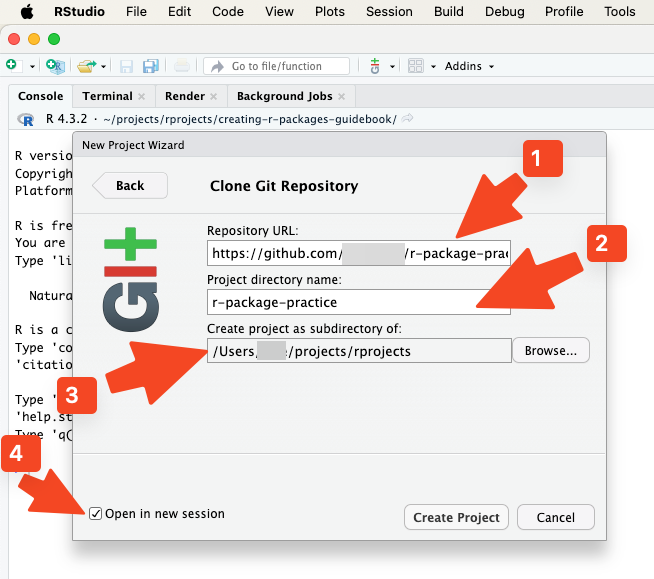
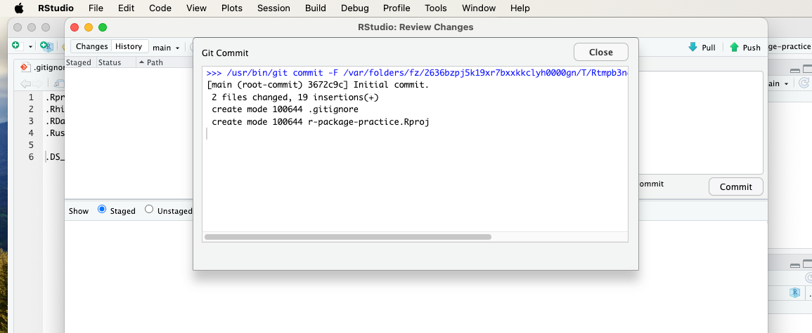

# Creating a repo for an R package

In this section, we'll guide you through the process of creating a
GitHub repository for your R package and opening it in RStudio using
version control.

## Create a new repo on GitHub

1.  Go to [GitHub](https://github.com/) and log in to your account.

2.  In the middle of the screen, you will find the button "Create a new
    repository". Above that button, you will be prompted to give your
    repository a name. For this tutorial, we'll use the name
    "r-package-practice". You also have to choose whether your
    repository will be public or private; for the sake of this practice,
    you may choose "Private". After these steps, click on the button
    "Create a new repository".

\

\

3.  Next, you'll see a screen from which you can copy your GitHub
    repository's URL address by clicking the Copy button.

\

## Clone the repo to computer

1.  Open RStudio on your local machine.
2.  Go to File \> New Project \> Version Control \> Git.

\

\

3.  In the "Repository URL" field, paste the URL of the GitHub
    repository you just created. When you press the Tab key on your
    keyboard once, the "Project directory name" will update accordingly
    immediately, and so will the suggested project's subdirectory below
    it. It is perhaps advisable to start this project in a new session,
    so you may tick the "Open in new session" checkbox. If you're happy
    with all the suggested fields, you may click "Create Project".

\

\

## Modify .gitignore file

1.  Next, we'll work on the .gitignore file. It contains the file types
    that you will not want to be pushed to the remote repository (here:
    to GitHub). Click on the .gitignore file's name.

\

\

2.  There is already useful content in the .gitignore file. We want to
    add one file type to .gitignore, and that is .DS_Store. It does not
    affect Windows users, but if even one MacOS-using colleague will be
    joining the development of your package at some point, you will want
    that file type to be added to .gitignore. Once you have added that
    file type to .gitignore, click the save icon located above it."

\

\

\

## Initial commit to GitHub

1.  You will now notice a couple of files below the Git tab on the
    top-right pane. You are now ready to make the initial commit to
    GitHub. Click the Commit icon.

\

\

2.  Tick all the new files, write a commit message, and click the Commit
    button.

\

\

3.  When you will see the following message, click the Close button.

\

\

4.  Then click the Push button.

\

\

5.  Upon successful completion of the commit push process, you will see
    the following notice. Congratulations! You may now close the notice
    and the commit window.

\

\

6. If you now go back to GitHub in your web browser and click on your
    repository's name, you can see a recent commit.

\

\

\

\

<a property="dct:title" rel="cc:attributionURL" href="https://creating-r-packages.netlify.app">Creating
R Packages: A Step-by-Step Guide</a> by
<a rel="cc:attributionURL dct:creator" property="cc:attributionName" href="https://www.linkedin.com/in/ville-langen/">Ville
Langén</a> is licensed under
<a href="https://creativecommons.org/licenses/by-sa/4.0/?ref=chooser-v1" target="_blank" rel="license noopener noreferrer" style="display:inline-block;">CC
BY-SA
4.0</a>

