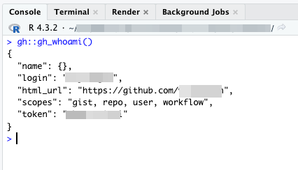
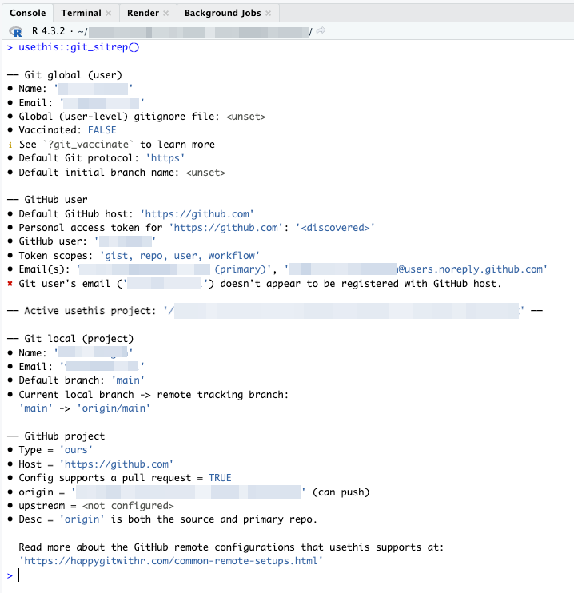

# Verifying the Git Setup

In this chapter, we'll verify that your setup is working correctly.
We'll use functions from the `gh` and `usethis` packages to ensure that
everything is configured properly.

The following commands are to be run in the Console in RStudio.

## GitHub Authentication

First, let's check if your GitHub authentication is set up correctly.
You can use the `gh::gh_whoami()` function to see the GitHub user that
your R session is authenticated as.

``` r
gh::gh_whoami()
```

If your setup is correct, this function should return your GitHub
username and other details about your GitHub account.

\



\

## Git Configuration

Next, we'll check the Git configuration using the `usethis::git_sitrep()`
function. This function provides a situational report on your Git
configuration and GitHub connection.

``` r
usethis::git_sitrep()
```

This function will output information about your Git configuration, such
as:

-   Your Git username and email
-   The remote URLs for your repository
-   GitHub PAT status
-   GitHub personal details


\




\

Review the output to ensure that your Git and GitHub configurations are
correctly set up.

---

In the next chapter, we embark on the exciting journey of creating your package, where we'll use the powerful `usethis::create_package()` function to kickstart the process.

\

\

\

<p xmlns:cc="http://creativecommons.org/ns#" xmlns:dct="http://purl.org/dc/terms/">

<a property="dct:title" rel="cc:attributionURL" href="https://creating-r-packages.netlify.app">Creating
R Packages: A Step-by-Step Guide</a> by
<a rel="cc:attributionURL dct:creator" property="cc:attributionName" href="https://www.linkedin.com/in/ville-langen/">Ville
Langén</a> is licensed under
<a href="https://creativecommons.org/licenses/by-sa/4.0/?ref=chooser-v1" target="_blank" rel="license noopener noreferrer" style="display:inline-block;">CC
BY-SA
4.0</a>

</p>
