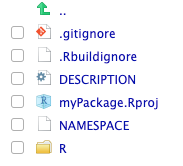
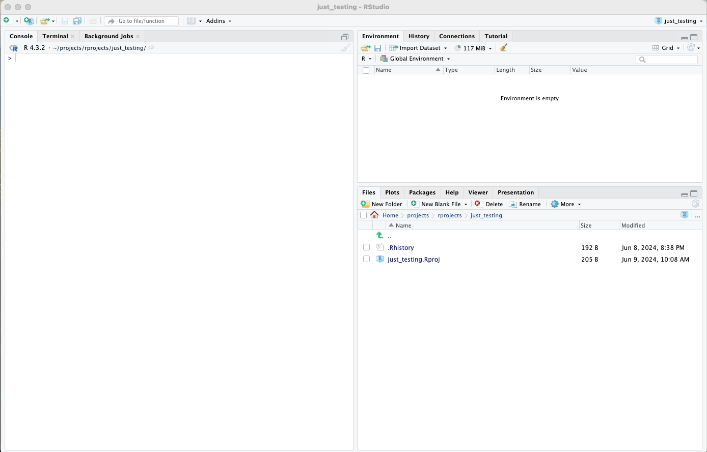

# Creating an R Package

In this chapter, we'll learn how to create a new R package using the
`usethis` package in R. Creating an R package allows you to organize
your functions, data, and documentation for easy distribution and use by
others.

## Prerequisites

First, ensure you have the necessary prerequisites for naming your
package:

-   **Package name**: Must start with a letter and can contain letters,
    numbers, and periods (".").
-   **Forbidden characters**: No special characters such as hyphens
    ("-"), underscores ("\_"), or spaces.
-   **Descriptive name**: Choose a name that broadly represents the
    functionality of your package since it may contain several functions
    and example data frames.
-   **Directory Path**: Decide on a directory where you want to create
    your package.

##  `create_package()`

To create a new R package, we'll use the `create_package()` function
from the `usethis` package. This function automates the process of
setting up the basic structure of an R package.

Here's how you can create a new package:

``` r
usethis::create_package("~/yourpath/yourpackagename")
```

Replace "\~/yourpath/yourpackagename" with the desired directory path
and package name. This command will create a new directory with the
specified package name and set up the necessary files and folders for
your package.

After running the command, you'll see a new directory with the following
structure:

\



\

Here's a brief description of each file and directory:

-   **.gitignore**: Used by Git to determine which files and directories
    to ignore in your project.
-   **.Rbuildignore**: Used by R to determine which files and
    directories to exclude from the package build process.
-   **DESCRIPTION**: Contains important metadata about your package such
    as the package name, version, author, and dependencies.
-   **myPackage.Rproj**: The RStudio project file that allows you to
    open the project in RStudio.
-   **NAMESPACE**: Controls the functions that are exported from your
    package and made available to users.
-   **R/**: This directory is where you'll store all your R scripts that
    define the functions in your package.

\

\

In the animated example seen below, I will create a package called
"myPackage" using the `usethis::create_package()` function.

\

\

\

\

---

In the following chapter, we will initialize a local Git repository, add and commit the files of our package to the repository, and push our package to GitHub.


\
\
\


<p xmlns:cc="http://creativecommons.org/ns#" xmlns:dct="http://purl.org/dc/terms/">

<a property="dct:title" rel="cc:attributionURL" href="https://creating-r-packages.netlify.app">Creating
R Packages: A Step-by-Step Guide</a> by
<a rel="cc:attributionURL dct:creator" property="cc:attributionName" href="https://www.linkedin.com/in/ville-langen/">Ville
Langén</a> is licensed under
<a href="https://creativecommons.org/licenses/by-sa/4.0/?ref=chooser-v1" target="_blank" rel="license noopener noreferrer" style="display:inline-block;">CC
BY-SA
4.0</a>

</p>
