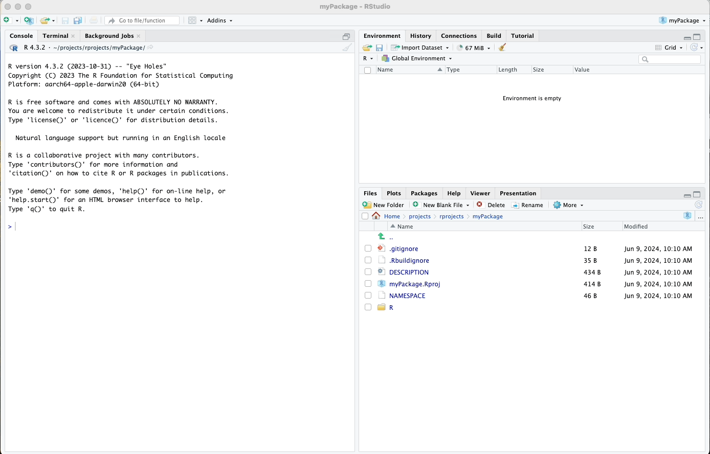
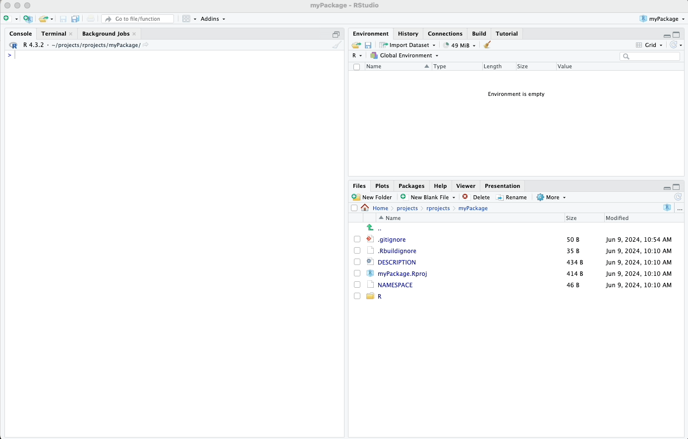
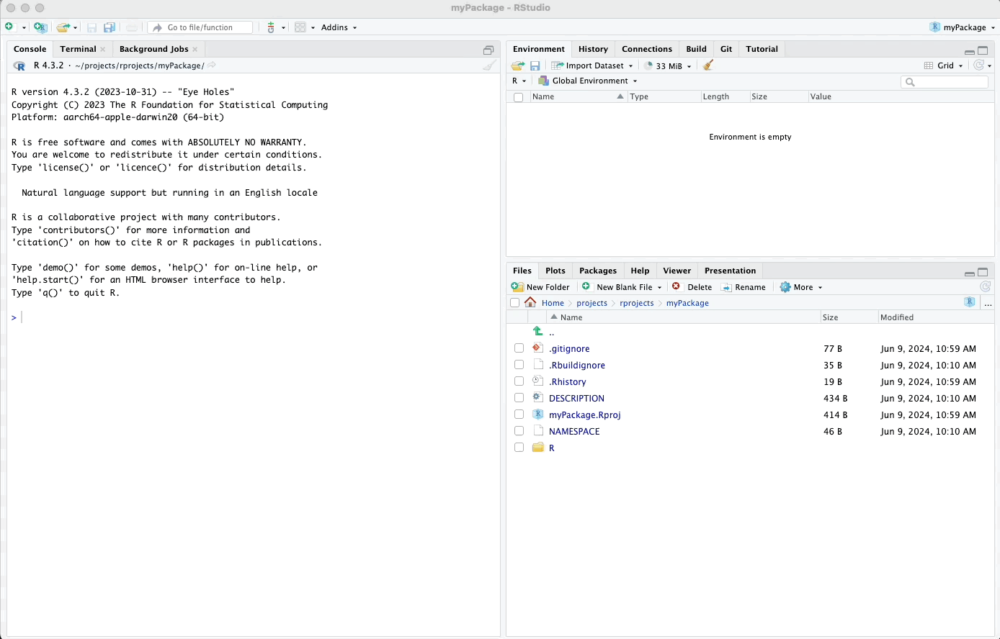
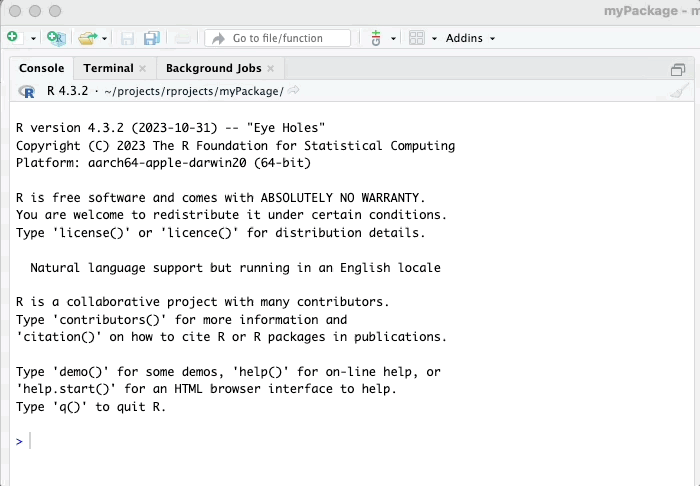
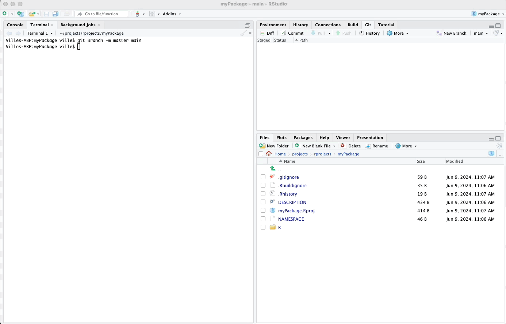

# Committing and Pushing to GitHub

In this chapter, we will initialize a local Git repository, add and
commit the files of our package to the repository, and push our package
to GitHub.

## .gitignore File

The `.gitignore` file specifies which files and directories should be
ignored by Git. This is useful for excluding files that are not relevant
to your project, such as temporary files or sensitive information. It is
a good practice to add the following files to your `.gitignore`:

-   `.DS_Store`
-   `.Rhistory`
-   `.RData`
-   `.Ruserdata`

To modify the `.gitignore` file, click on it in the bottom-right pane of
RStudio, add the entries listed above, and then click the save icon.

Please see my animated example below:

\



\

## Initializing Git

To initialize a Git repository for your package, you can use the
`usethis::use_git()` function. This function sets up Git for your
package and creates an initial commit.

Run the following command in your R console:

``` r
usethis::use_git()
```

When prompted for permission to commit files, say "Absolutely not", as
committing at this stage can interfere with the next steps. If asked
whether to restart your R session, answer "Yeah".

Please see my animated example below:

\



\

## Committing Files

After initializing Git, you need to commit your files manually. In
RStudio, follow these steps:

1.  In the top-right pane, go to the "Git" tab.
2.  Select all the files you want to commit by clicking the checkboxes
    next to them.
3.  Click the "Commit" button.
4.  Write a commit message, such as "Initial commit".
5.  Click the "Commit" button in the commit dialog box.

This creates an initial commit with all your package files.

Please see my animated example below:

\



\

## Changing the Default Branch

In recent years, it has become customary to use "main" instead of
"master" as the default branch name for new repositories due to the
inclusive language initiatives across the tech community. Additionally,
using "main" aligns better with GitHub's default settings, facilitating
smoother integrations.

To change the branch name in your local repository to "main," you can
use the terminal within RStudio. Here's how:

1.  Open the Terminal tab next to the Console tab in RStudio.
2.  Type the following command to rename the branch:

``` bash
git branch -m master main
```

Please see my animated example below:

\



\

## Pushing to GitHub

Once you have committed your files, you can push your package to GitHub
using the usethis::use_github() function. This function creates a new
GitHub repository and pushes your local Git repository to GitHub.

Run the following command in your R console:

``` r
usethis::use_github()
```

Follow the prompts to complete the process. This will create a new
repository on GitHub and push your local commits to the remote
repository.

If prompted for permission to commit any further files at this point, say "Negative".

Please see my animated example below:

\



\

You have now successfully committed and pushed your package to GitHub!

In the following chapter, we will start working on special files such as `DESCRIPTION`, `README.md`, and others, which are essential for documenting and detailing your package.

\
\
\

<p xmlns:cc="http://creativecommons.org/ns#" xmlns:dct="http://purl.org/dc/terms/">

<a property="dct:title" rel="cc:attributionURL" href="https://creating-r-packages.netlify.app">Creating
R Packages: A Step-by-Step Guide</a> by
<a rel="cc:attributionURL dct:creator" property="cc:attributionName" href="https://www.linkedin.com/in/ville-langen/">Ville
Langén</a> is licensed under
<a href="https://creativecommons.org/licenses/by-sa/4.0/?ref=chooser-v1" target="_blank" rel="license noopener noreferrer" style="display:inline-block;">CC
BY-SA
4.0</a>

</p>
