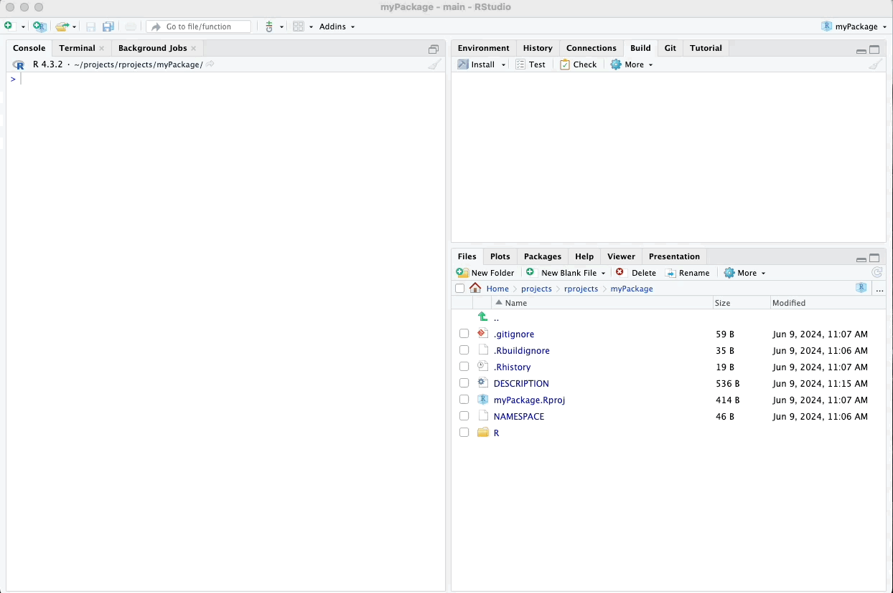
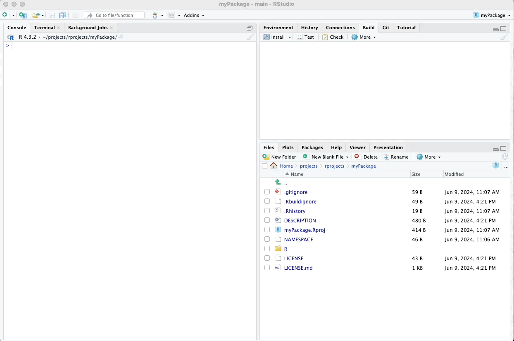
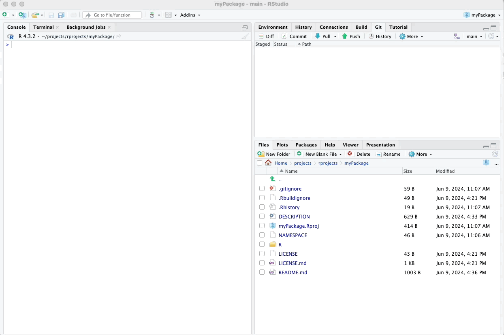
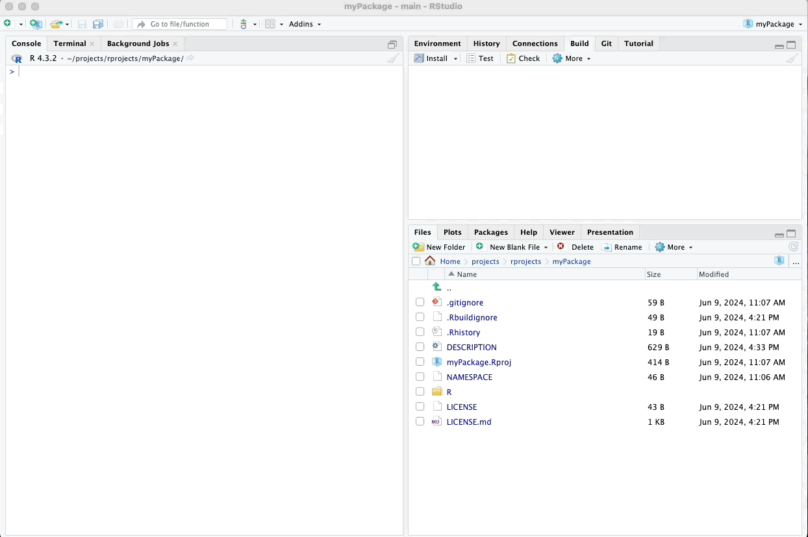
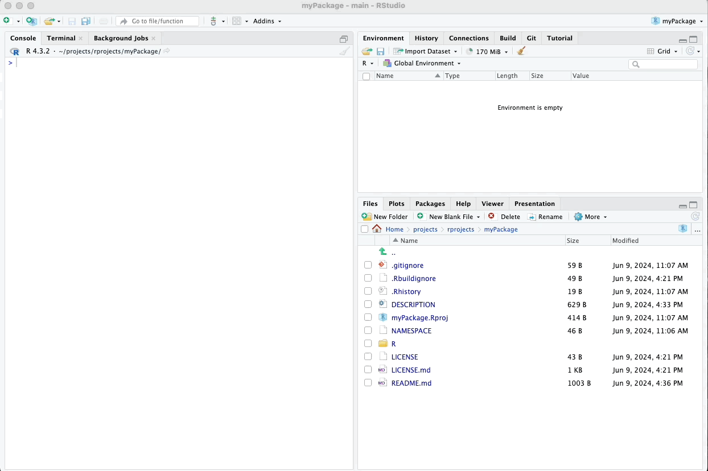

# Metadata and License

In this chapter, we will focus on refining the metadata of our package
and ensuring it complies with best practices for package development.

## License File

Including a license in our package ensures that users understand the
terms under which they can use, modify, and distribute our code. We can
generate a license file using the
`usethis::use_mit_license("Your Name")` function, where "Your Name"
should be replaced with our name or the name of the package author. This
function creates a LICENSE file in the package directory containing the
MIT License text.

``` r
# Generating License File
usethis::use_mit_license("Your Name")
```

\

Please see my animated example below:

\



\

## DESCRIPTION File

The DESCRIPTION file provides metadata about our package, including its
title, version, author, and dependencies. If you have followed along
with this tutorial, you should already have a partially completed
DESCRIPTION file. This file includes essential information about your
package, such as the package's name, title, version, author details, and
license.

If you don't have a DESCRIPTION file yet, you can create one using the
usethis::use_description() function. This function generates a basic
DESCRIPTION file, which you can then edit to include additional details.

``` r
# Modifying DESCRIPTION File
usethis::use_description()
```

\

Please see my animated example below:

\



\

For this example package that we are writing, we could use the following
DESCRIPTION file text. Click on the DESCRIPTION file in the bottom-right
pane and replace its contents with these contents. Make sure to type in
your name instead of mine.

``` r
Package: myPackage
Type: Package
Title: My Awesome R Package
Version: 0.1.0
Author: Ville Langén
Maintainer: Ville Langén <email address here>
Description: This package provides functions to work with movie data and calculate group means based on binary variables. It also includes an example dataset.
License: MIT + file LICENSE
Encoding: UTF-8
LazyData: true
RoxygenNote: 7.1.1
Imports: 
    ggplot2movies
```

Remember to write out dependencies, in this case ggplot2movies, because our function random_movie_recommendation() will use it.

\



\

## README File

A README file is essential for providing an overview of the package, its
functionality, and how to use it. We can generate a README file using
the usethis::use_readme_md() function. This function creates a README.md
file in the package directory, which we can then edit to include
relevant information about our package, including installation
instructions, usage examples, and acknowledgments.

``` r
# Generating README File
usethis::use_readme_md()
```

\

Please see my animated example below:

\



\

## Pushing metadata to Github

After making changes to the DESCRIPTION file, README, and other package
files, it's important to commit and push these changes to your GitHub
repository. This ensures that your work is saved and synchronized with
the remote repository.

Here’s how you can do it using the upper right pane of RStudio:

1.  Open the Git Pane:

-   In RStudio, you’ll see the Git tab in the upper right pane. Click on
    it to view your current repository status.

2.  Stage Your Changes:

-   You’ll see a list of files that have been modified. Check the boxes
    next to the files you want to stage for the commit (e.g.,
    DESCRIPTION, README.md, LICENSE).

3.  Commit Your Changes:

-   Click the "Commit" button. This will open a new window where you can
    review your changes.
-   Enter a meaningful commit message summarizing the changes you made
    (e.g., "Create metadata and license files").

4.  Push Your Changes to GitHub:

-   After committing, click the "Push" button to send your changes to
    the remote repository on GitHub.

\

Here’s a visual guide:

\



\

## Viewing README on GitHub

After committing and pushing your changes, you can view the updated
metadata files and README on your GitHub repository. Follow these steps:

1.  Navigate to Your GitHub Repository:

-   Open your web browser and go to the GitHub repository where you have
    pushed your changes.

2.  Refresh the Page:

-   Click the refresh button on your browser to reload the repository
    page and ensure the latest changes are visible.

3.  View the Updated Files:

-   Scroll down to the file list in your repository. You should see the
    updated DESCRIPTION, README.md, and LICENSE files.

4.  Check the README:

-   Scroll down to see how the README.md file is rendered. GitHub
    automatically formats Markdown files, so you will see a nicely
    formatted version of your README with headings, lists, and other
    Markdown elements.

\

Here’s a visual guide:

\


\

By addressing these aspects of package development, we enhance the
professionalism and usability of our package, making it more accessible
to potential users and contributors.

In the next section, we will incorporate into our package the functions and example data that we wrote earlier.


\

\

\

<p xmlns:cc="http://creativecommons.org/ns#" xmlns:dct="http://purl.org/dc/terms/">

<a property="dct:title" rel="cc:attributionURL" href="https://creating-r-packages.netlify.app">Creating
R Packages: A Step-by-Step Guide</a> by
<a rel="cc:attributionURL dct:creator" property="cc:attributionName" href="https://www.linkedin.com/in/ville-langen/">Ville
Langén</a> is licensed under
<a href="https://creativecommons.org/licenses/by-sa/4.0/?ref=chooser-v1" target="_blank" rel="license noopener noreferrer" style="display:inline-block;">CC
BY-SA
4.0</a>

</p>
