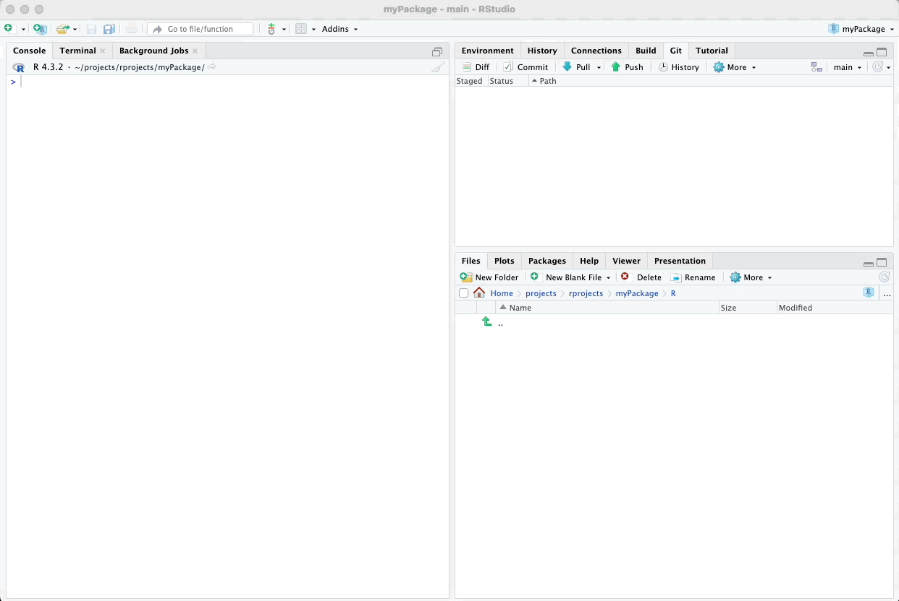
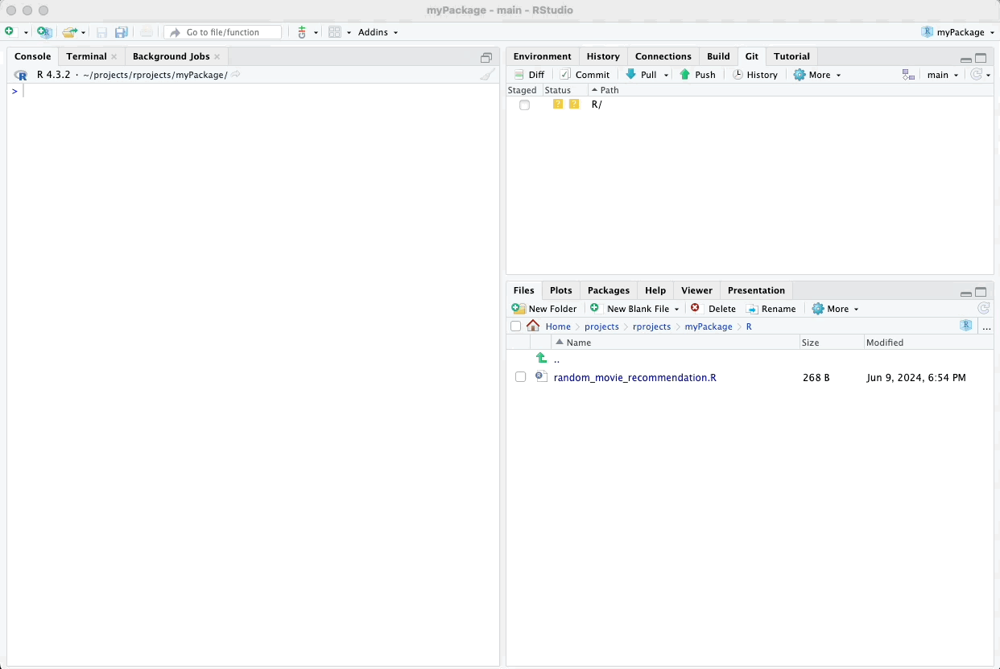
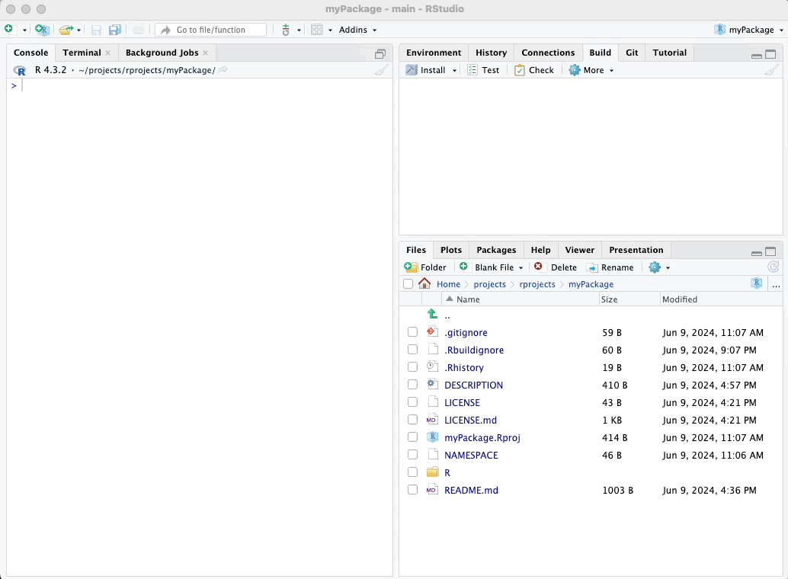
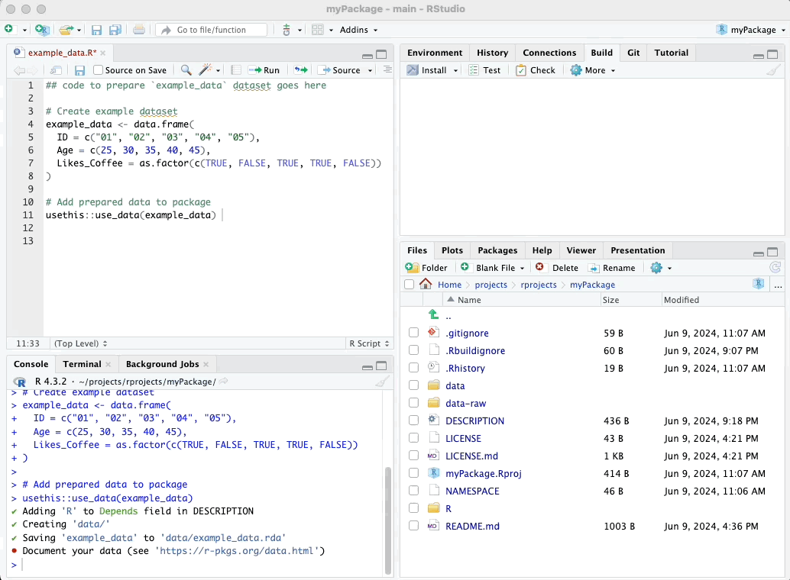

# Adding Functions and Data

In this chapter, we will integrate the functions and example dataset
that we previously created into our package using the `use_r()` approach
provided by the `usethis` package.

## Adding Functions

To add the functions to our package, we will first create an R script
file for each function. We can use the `use_r()` function to automate
this process. This function creates a new R script file in the R/
directory of our package.

\

Please see visual guides below:

\

``` r
# Adding the random movie recommendation function
usethis::use_r("random_movie_recommendation.R")
```

\



\

``` r
# Adding the calculate group mean function
usethis::use_r("calculate_group_mean.R")
```

\



\

## Adding Example Data

Similarly, we can add the example dataset to our package by creating an
R script file containing the dataset. It is generally a good idea to
save the original script that creates your example dataset. This script
should be placed in a folder called "data-raw". You certainly want that
folder and script in your GitHub repository but not to be compiled with
your package. Thus, that folder has to be included in a special file
called `.Rbuildignore`.

Luckily, there is a convenience function called
`usethis::use_data_raw()` in the `usethis` package that does all this.
You can run this function and provide your example dataset's name as an
argument, particularly if there is only one dataset, but
`use_data_raw()` can also be run without any argument.

When you run `use_data_raw()`, it:

-   Creates the `data-raw` folder.
-   Adds `data-raw` to `.Rbuildignore`.
-   Creates a data script where you can paste the script that creates
    your example data.

In the data script, you will want to have `use_data(your_dataset_name)`
as the last line, which converts the dataset into an `.rda` file and
places it into the data/ folder.

Here's how you can do it:

``` r
# Adding the example dataset
usethis::use_data_raw("example_data")
```

\

After running this function, the script file ("example_data.R") will be
opened automatically. Paste the code that creates your example dataset
into this file. At the end of the script, add the following line to save
the dataset:

``` r
# Add prepared data to package
usethis::use_data(example_data)
```

\

Here’s a visual guide:

\


\

Run the whole script to incorporate your data into your package. This
will ensure your dataset is properly saved and included in your package.

Remember to save that `example_data.R` script file before closing it.

## Pushing again to GitHub

At this point, it is wise to commit and push all the changes to GitHub
to keep your project up-to-date and ensure you have a backup of your
progress. Follow these steps to do so:

1.  **Commit your changes**:

-   In RStudio, go to the top-right pane and click on the "Git" tab.
-   You will see a list of the files that have been changed. Check the
    boxes next to all the files you want to commit.
-   Click on the "Commit" button.
-   In the "Commit message" field, write a descriptive message about the
    changes you made, for example, "Added example functions and
    dataset".
-   Click on the "Commit" button at the bottom right of the window.

2.  **Push your changes**:

-   After committing, click on the "Push" button in the Git tab.
-   This will upload your committed changes to your GitHub repository.

\

Here is a visual guide:

\



\

---

In the next section, we’ll focus on testing the functions and example data we have incorporated into our package.


\

\

\

<p xmlns:cc="http://creativecommons.org/ns#" xmlns:dct="http://purl.org/dc/terms/">

<a property="dct:title" rel="cc:attributionURL" href="https://creating-r-packages.netlify.app">Creating
R Packages: A Step-by-Step Guide</a> by
<a rel="cc:attributionURL dct:creator" property="cc:attributionName" href="https://www.linkedin.com/in/ville-langen/">Ville
Langén</a> is licensed under
<a href="https://creativecommons.org/licenses/by-sa/4.0/?ref=chooser-v1" target="_blank" rel="license noopener noreferrer" style="display:inline-block;">CC
BY-SA
4.0</a>

</p>
