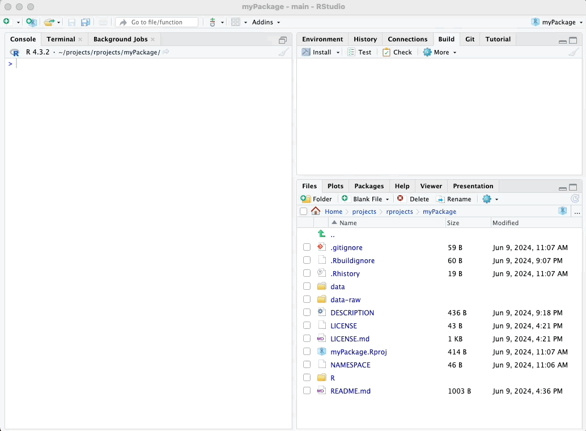
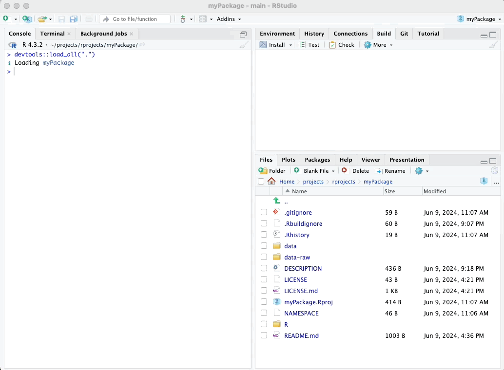
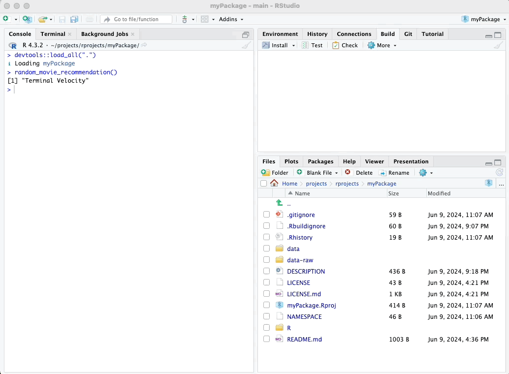
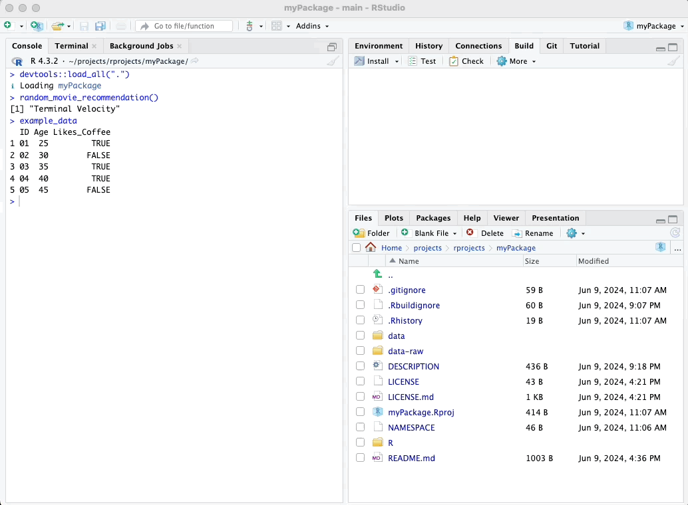

# Testing Functions

In this chapter, we'll focus on testing the functions and example data
we have incorporated into our package. Ensuring that everything works as
expected is a crucial step in package development.

## Loading the Package

Before testing, we need to load our package. We can do this using the
`devtools::load_all()` function, or alternatively, by clicking the "Load
All" button in the top-right pane of RStudio.

### Using devtools::load_all()

To load your package `using devtools::load_all()`, simply run the
following code in your R console:

``` r
devtools::load_all()
```

### Using the Load All Button

Alternatively, you can load your package using the "Load All" button in
the top-right pane of RStudio. It can be found in the Build tab. Click
the gear-looking "More" icon and select "Load All" to load all the
functions and data in your package.

\

Here’s a visual guide:

\



\

## Testing the Functions

Once the package is loaded, we can start testing our functions to ensure
they work as expected.

### Testing random_movie_recommendation

To test the `random_movie_recommendation` function, simply call it in
the R console:

``` r
random_movie_recommendation()
```

You should see a random movie title from the ggplot2movies dataset. See
visual guide below:

\



\

### Verifying the Example Data

We can also verify that our example data has been correctly incorporated
by simply viewing it:

``` r
example_data
```

This should display the dataset we created earlier. See visual guide
below:

\



\

### Testing calculate_group_mean

To test the calculate_group_mean function, call it with the example_data
dataset:

``` r
calculate_group_mean(example_data, "Age", "Likes_Coffee")
```

This should return the mean age of the group who likes coffee (denoted
by the `Likes_Coffee` variable). See visual guide below:

\



\

\

In the next section, we will document our functions and example data
properly.

\

\

\

<p xmlns:cc="http://creativecommons.org/ns#" xmlns:dct="http://purl.org/dc/terms/">

<a property="dct:title" rel="cc:attributionURL" href="https://creating-r-packages.netlify.app">Creating
R Packages: A Step-by-Step Guide</a> by
<a rel="cc:attributionURL dct:creator" property="cc:attributionName" href="https://www.linkedin.com/in/ville-langen/">Ville
Langén</a> is licensed under
<a href="https://creativecommons.org/licenses/by-sa/4.0/?ref=chooser-v1" target="_blank" rel="license noopener noreferrer" style="display:inline-block;">CC
BY-SA
4.0</a>

</p>
