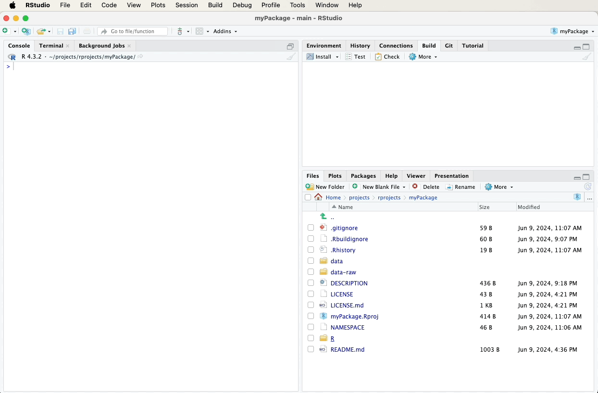

# Documentation

In this chapter, we'll focus on documenting the functions and datasets
in our package. Proper documentation is essential for helping users
understand how to use your package effectively.

## **roxygen2** skeletons

When documenting functions and datasets in an R package, it is
recommended to use **roxygen2** skeletons. These are snippets of a kind
of markup language, written directly above your functions and dataset
definitions. They serve as a convenient way to generate Rd (R
documentation) files, which provide detailed information about the
usage, parameters, and examples for your functions and datasets. In
other words, **roxygen2** is the front end that produces Rd files from
your comments in your .R files.

So, the ground rule is:

\

***Thou shalt never directly create or edit Rd (R documentation)
files***

\

— rather, always document your functions and example datasets using
**roxygen2** comments.

## Generating Skeletons

To create **roxygen2** skeletons in RStudio:

1.  Open the R script file that contains your function or dataset
    definition.
2.  Place the cursor inside the function or dataset definition.
3.  Navigate to the "Code" menu at the top of RStudio.
4.  Select "Insert Roxygen Skeleton" from the dropdown menu.

RStudio will automatically generate a **roxygen2** comment skeleton with
placeholders for you to fill out, such as `@param`, `@return`, and
`@examples`.

This process is explained in more detail and with videos below when I
show how to create documentation for `random_movie_recommendation` and
`calculate_group_mean`.

## Documenting Functions

Let's start by documenting our functions using **roxygen2** skeletons.
Below, we'll add **roxygen2** comments to our
`random_movie_recommendation` and `calculate_group_mean` functions.

### Documenting `random_movie_recommendation`

To document the `random_movie_recommendation` function, first navigate
to the file containing this function in the bottom-right pane of RStudio
and click on it to open it. Then, fill in the following **roxygen2**
comments above your `random_movie_recommendation` function using the
"Code" menu and selecting "Insert Roxygen Skeleton". A video below the
code will demonstrate these steps visually:

``` r
#' Random Movie Recommendation
#'
#' This function randomly recommends a movie from the `ggplot2movies` dataset.
#'
#' @return A character string representing the title of a randomly selected movie.
#' @export
#' @examples
#' random_movie_recommendation()
random_movie_recommendation <- function() {
  # Load the movies dataset
  data(movies, package = "ggplot2movies")
  
  # Get the movie title at the random index
  recommended_movie <- sample(movies$title, 1)
  
  # Return the recommended movie
  return(recommended_movie)
}
```

\


\

### Documenting `calculate_group_mean`

To document the `calculate_group_mean` function, first navigate to the
file containing this function in the bottom-right pane of RStudio and
click on it to open it. Then, fill in the following **roxygen2**
comments above your `calculate_group_mean` function using the "Code"
menu and selecting "Insert Roxygen Skeleton". A video below the code
will demonstrate these steps visually:

``` r
#' Calculate Group Mean
#'
#' This function calculates the mean of a numeric variable for rows where another variable has the value TRUE.
#'
#' @param df A data frame containing the data.
#' @param numeric_var A string representing the name of the numeric variable.
#' @param factor_var A string representing the name of the factor (binary) variable.
#' @return A numeric value representing the mean of the specified numeric variable for the filtered rows.
#' @export
#' @examples
#' calculate_group_mean(example_data, "Age", "Likes_Coffee")
calculate_group_mean <- function(df, numeric_var, factor_var) {
  # Filter the dataframe for rows where the factor variable is TRUE
  filtered_df <- df[df[[factor_var]] == TRUE, ]
  
  # Calculate the mean of the numeric variable for the filtered dataframe
  mean_val <- mean(filtered_df[[numeric_var]])
  
  # Return the mean value
  return(mean_val)
}
```

\



\

## Documenting Datasets

Next, we'll document our example dataset. **Roxygen2** provides a way to
document datasets by adding comments in a separate R script file.

### Documenting example_data

Create a new R script file named data.R in the R directory and add the
following **roxygen2** comments. A video below the code will demonstrate
these steps visually:

``` r
#' Example Data
#'
#' A dataset containing example data.
#'
#' @format A data frame with 5 rows and 3 variables:
#' \describe{
#'   \item{ID}{A character vector representing the ID of each observation.}
#'   \item{Age}{A numeric vector representing the age of each observation.}
#'   \item{Likes_Coffee}{A factor vector indicating whether the observation likes coffee (TRUE) or not (FALSE).}
#' }
#' @examples
#' example_data
"example_data"
```

\


\

## Generating Documentation

After adding the **roxygen2** comments, we need to generate the
documentation files. This can be done using the `devtools::document()`
function, which processes the **roxygen2** comments and creates the Rd
files.

``` r
devtools::document()
```

Alternatively, you can use the "Document" button. It can be found in the Build tab. Click
the gear-looking "More" icon and select "Document".


\


\

## Documentation to GitHub

After updating and generating your documentation, it’s important to push
these changes to your GitHub repository to keep your project up-to-date
and allow others to see the latest developments.

Refer to earlier sections for detailed instructions on how to commit and
push changes using the Git pane in RStudio, or watch the video guide
below for a visual walkthrough. A suitable commit message for
documentation updates might be:

``` r
Update documentation for functions and datasets
```

\


\

---

In the next chapter, we'll test how these documents work to ensure that
the documentation accurately reflects the functionality of your package.

\

\

\

<p xmlns:cc="http://creativecommons.org/ns#" xmlns:dct="http://purl.org/dc/terms/">

<a property="dct:title" rel="cc:attributionURL" href="https://creating-r-packages.netlify.app">Creating
R Packages: A Step-by-Step Guide</a> by
<a rel="cc:attributionURL dct:creator" property="cc:attributionName" href="https://www.linkedin.com/in/ville-langen/">Ville
Langén</a> is licensed under
<a href="https://creativecommons.org/licenses/by-sa/4.0/?ref=chooser-v1" target="_blank" rel="license noopener noreferrer" style="display:inline-block;">CC
BY-SA
4.0</a>

</p>
