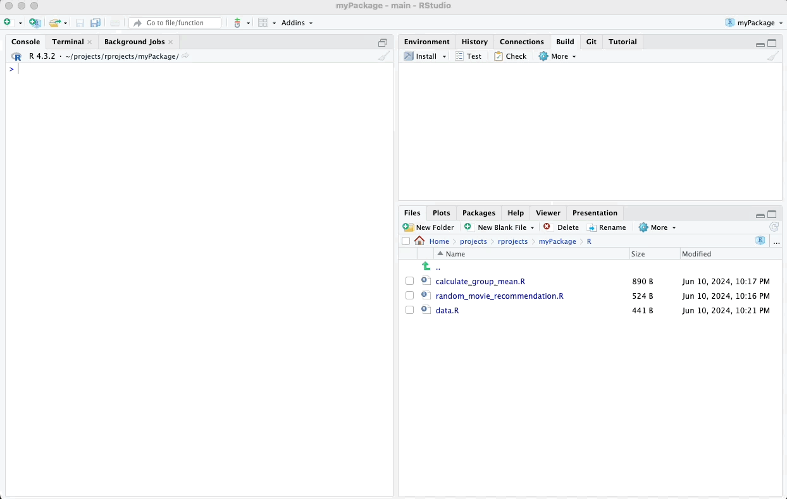
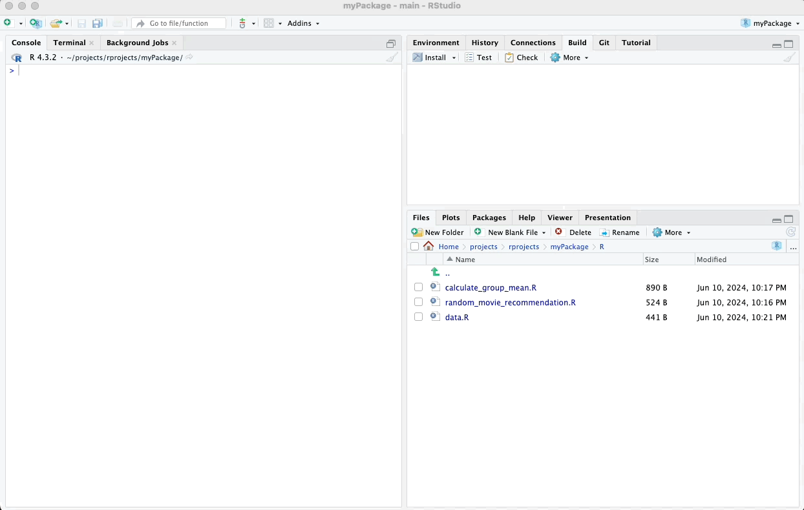

# Testing Your Documentation

Once you have documented your functions and datasets using **roxygen2**,
it is important to test your documentation to ensure that it accurately
reflects the functionality of your package. This chapter will guide you
through testing your package's documentation.

If you have been following this tutorial chronologically, you should
already have your package and its documentation loaded. However, if for
any reason your package is not loaded, you can easily load everything
using the following command:

``` r
devtools::load_all(".")
```

## Documentation for Functions

You can view the documentation for a particular function by using the `?`
followed by the function name.

In other words, these help files you have created function just like those you would encounter with official packages on CRAN.


For example, to view the documentation
for the `random_movie_recommendation` function, you would use:

``` r
?random_movie_recommendation
```

This will open the help page for the function, where you can review the
descriptions, parameters, examples, and other relevant information
included in your **roxygen2** comments.

\



\

## Documentation for Datasets

To view the documentation for example datasets, you can use the help
function with the dataset name. For example, to view the documentation
for the example_data dataset, you would use:

``` r
?example_data
```

\



\

---

In the next chapter, we will explore how to install your package.

\

\

\

<p xmlns:cc="http://creativecommons.org/ns#" xmlns:dct="http://purl.org/dc/terms/">

<a property="dct:title" rel="cc:attributionURL" href="https://creating-r-packages.netlify.app">Creating
R Packages: A Step-by-Step Guide</a> by
<a rel="cc:attributionURL dct:creator" property="cc:attributionName" href="https://www.linkedin.com/in/ville-langen/">Ville
Langén</a> is licensed under
<a href="https://creativecommons.org/licenses/by-sa/4.0/?ref=chooser-v1" target="_blank" rel="license noopener noreferrer" style="display:inline-block;">CC
BY-SA
4.0</a>

</p>
