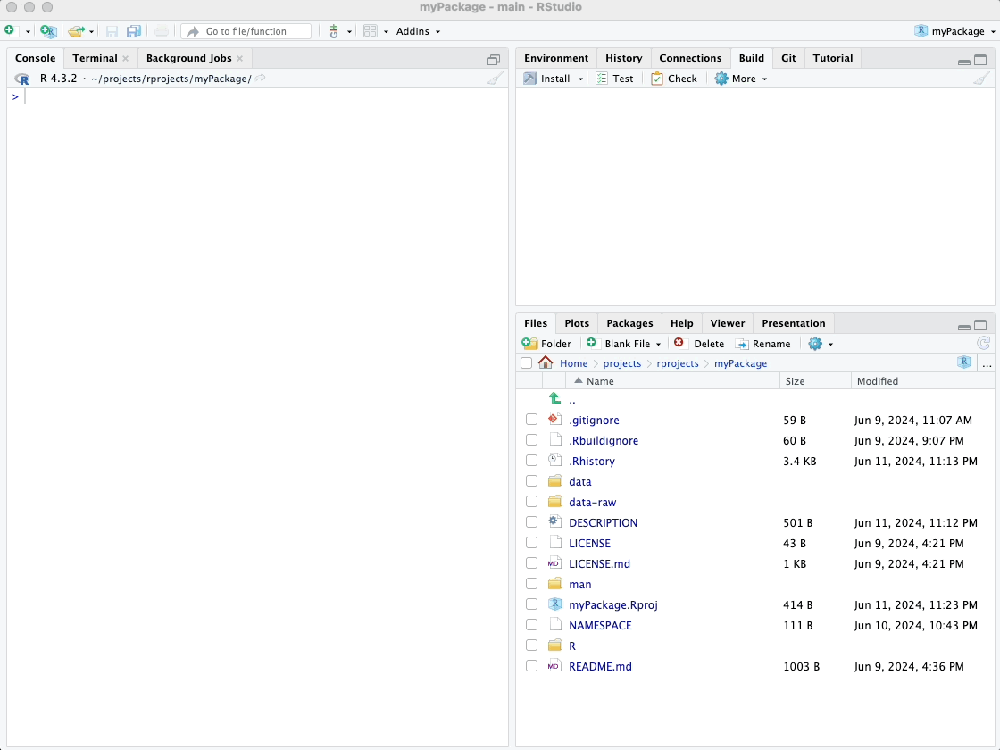
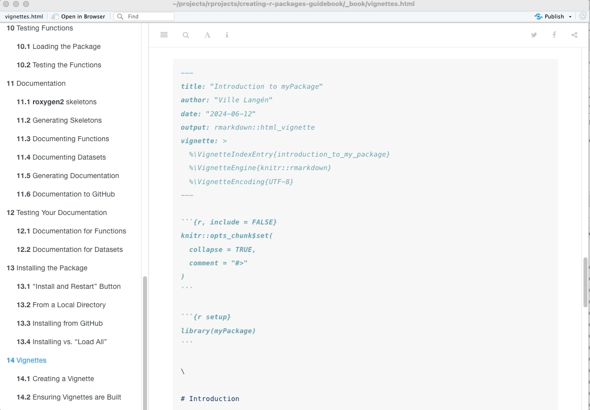
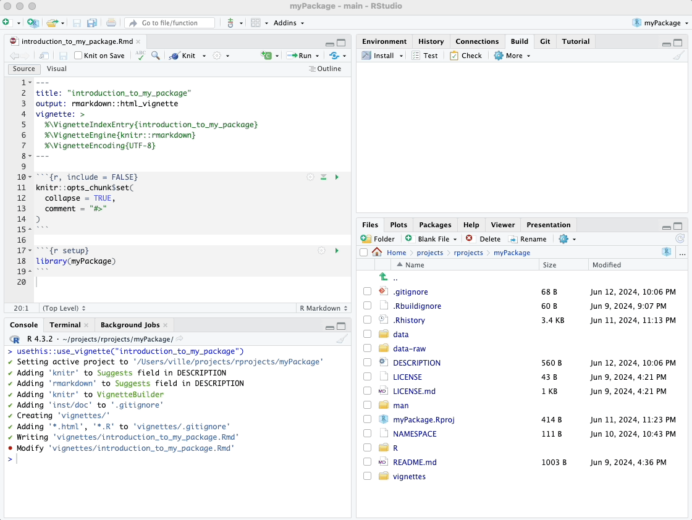
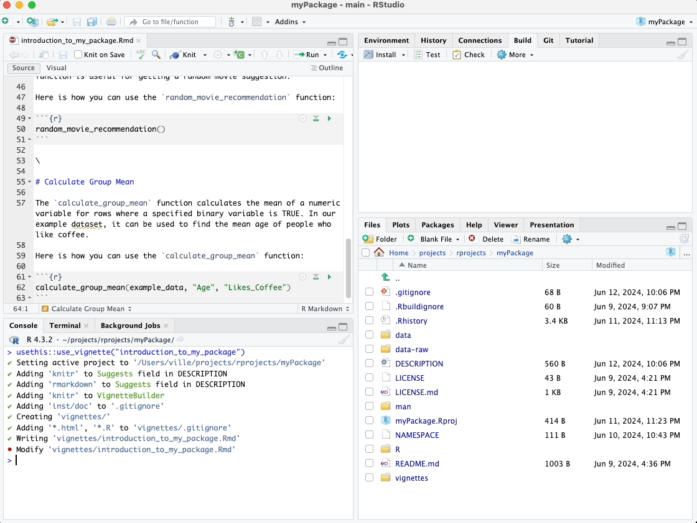
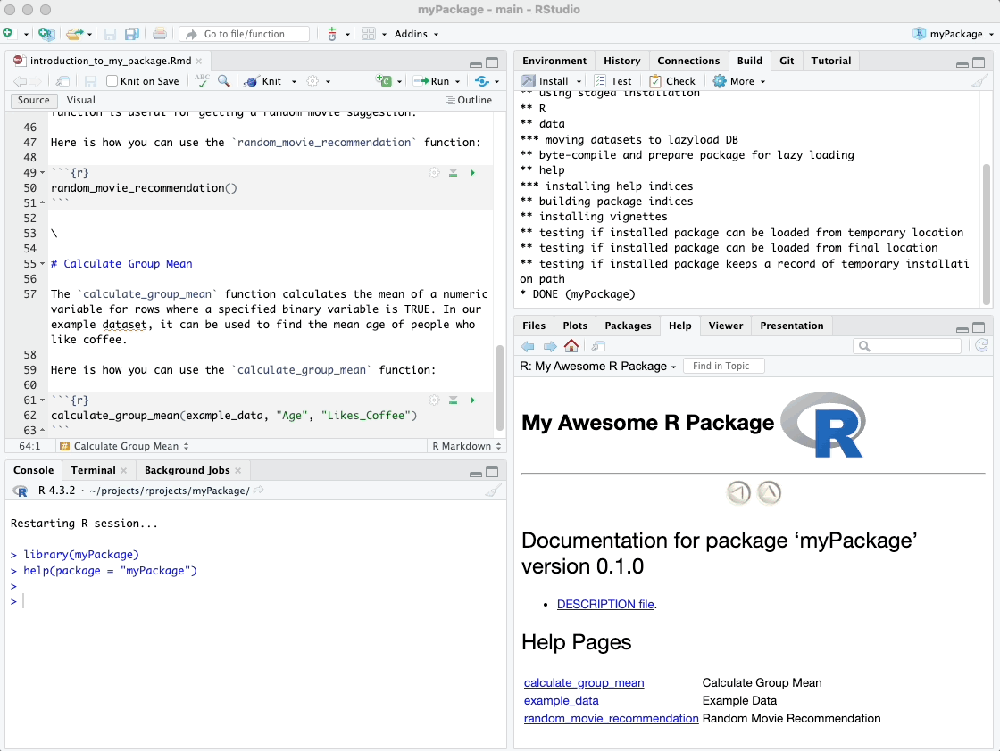
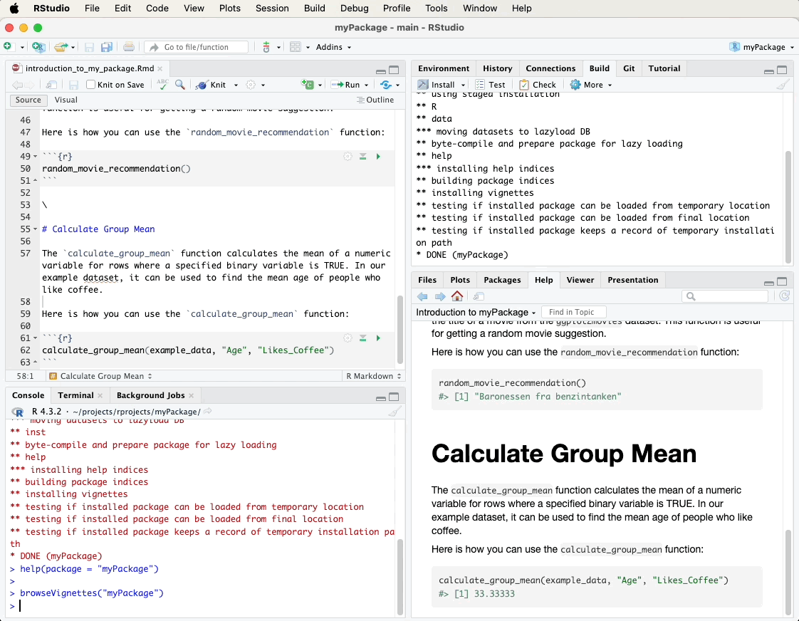

# Vignettes

In this chapter, we'll walk through the steps to create a vignette for
your package. Vignettes are long-form documentation that provide
comprehensive examples and explanations of how to use your package. They
are particularly useful for tutorials and detailed use cases.

It's worth noting that typically, one vignette per package is
sufficient, unless your package is very large and encompasses multiple
distinct functionalities.

If you have followed this tutorial chronologically, you will have your
package and documentation loaded. However, if for some reason you don't
anymore, you can load up everything with:

``` r
devtools::load_all(".")
```

You'll soon find that the vignettes you create will work just like those
you would encounter with official packages on CRAN.

## Creating a Vignette

First, let's create a vignette using the `usethis::use_vignette()`
function. This function sets up the necessary infrastructure for
vignettes in your package.

``` r
usethis::use_vignette("introduction_to_my_package")
```

After running this command, a directory called vignettes/ will be
created in your package, and an .Rmd (R Markdown) file for your vignette
will be added. It will also automatically update your DESCRIPTION file
to include the required dependencies (knitr, rmarkdown) for processing R
Markdown files.

The `usethis::use_vignette()` function will automatically open the
created R Markdown vignette file. The YAML (YAML Ain't Markup Language)
header of the created vignette file contains three rows forming a
special "skeleton" that should not be modified. These rows are under the
`vignette: >` section and ensure the correct processing and indexing of
your vignette. You can change the `title` field to suit your vignette's
title.

Look below for my video showcasing the `usethis::use_vignette()`
function.

\



\

After creating the vignette file, I recommend copying my example
vignette R Markdown code from this e-book over the vignette that
`usethis::use_vignette()` created. This will give you a good starting
point for vignette editing. The example code, showcased under the
subheader "Example Vignette R Markdown Code," is provided further down
the page, and the video below demonstrates how to copy and paste it into
your newly created vignette file.

Remember to save your vignette (.Rmd) file after copying! Also, replace
my name ("Ville Langén") with your own name.

\



\



\

### Example Vignette R Markdown Code

```` markdown
---
title: "Introduction to myPackage"
author: "Ville Langén"
date: "`r Sys.Date()`"
output: rmarkdown::html_vignette
vignette: >
  %\VignetteIndexEntry{introduction_to_my_package}
  %\VignetteEngine{knitr::rmarkdown}
  %\VignetteEncoding{UTF-8}
---

`r ''````{r, include = FALSE}
knitr::opts_chunk$set(
  collapse = TRUE,
  comment = "#>"
)
```

`r ''````{r setup}
library(myPackage)
```

\

# Introduction

This is an example vignette for the `myPackage` package, an example package created as part of my tutorial on making R packages. This practice package contains a couple of functions. One of them, `random_movie_recommendation`, utilizes the `ggplot2movies` package from CRAN, which provides a dataset of movies. The other function, `calculate_group_mean`, uses example data included in `myPackage`.

## Example Data

The `example_data` dataset included in this package contains a small sample of data for demonstration purposes. It has three columns: `ID`, `Age`, and `Likes_Coffee`. Here is how you can load and view the dataset:

`r ''````{r}
# Load the example dataset
data(example_data, package = "myPackage")

# View the dataset
example_data
```

\

# Random Movie Recommendation

The `random_movie_recommendation` function randomly selects and returns the title of a movie from the `ggplot2movies` dataset. This function is useful for getting a random movie suggestion.

Here is how you can use the `random_movie_recommendation` function:

`r ''````{r}
random_movie_recommendation()
```

\

# Calculate Group Mean

The `calculate_group_mean` function calculates the mean of a numeric variable for rows where a specified binary variable is TRUE. In our example dataset, it can be used to find the mean age of people who like coffee.

Here is how you can use the `calculate_group_mean` function:

`r ''````{r}
calculate_group_mean(example_data, "Age", "Likes_Coffee")
```
````

## Building Vignettes

Perhaps surprisingly, clicking "Install" on the top-right pane under
"Build" in RStudio does not automatically build the vignette. This can
be verified by running the `help(package = "myPackage")` command, as
demonstrated below in the video.

\



\

This is because, by default, RStudio does not build vignettes during
package installation to save time and avoid unnecessary processing.

However, we can force install the package again from its local folder,
specifying that the vignette needs to be built. In my case, the command
would be as follows, but in your case, the folder path will be
different:

``` r
devtools::install_local("/Users/ville/projects/rprojects/myPackage/",
            build_vignette = TRUE,
            force = TRUE)
```

\

As shown in the video below, running this command force-installs our
package over the existing installation, this time building the vignette
as well. Now, when we run `help(package = "myPackage")`, the vignette is
included in the help documentation.

\



\

Alternatively, you can push your R package project to your GitHub
repository after creating the vignette. Once pushed, you can install it
from the GitHub repo using the command:

``` r
devtools::install_github("username/myPackage", build_vignettes = TRUE)
```

Simply replace `"username/myPackage"` with your GitHub username and
repository name in that command. This alternative method also triggers
the vignette to be built during installation.

Viewing Vignettes in Browser

To view the vignettes for your package in a browser, use the following
code:

``` r
browseVignettes("myPackage")
```

Running this command will open a browser window displaying all the
available vignettes included in your package.

## Pushing to GitHub

After creating and building your vignette, it's a good practice to push
your changes to GitHub. Refer to earlier sections on how to do that or
watch the video guide below. A suitable commit message could be "Add
vignette for myPackage".

\



---

In the next chapter, we'll explore **pkgdown**, which generates a comprehensive website for your package with just one simple command. It's an efficient way to present your package's documentation, including vignettes and function references, to users and collaborators.


\

\

\

<p xmlns:cc="http://creativecommons.org/ns#" xmlns:dct="http://purl.org/dc/terms/">

<a property="dct:title" rel="cc:attributionURL" href="https://creating-r-packages.netlify.app">Creating
R Packages: A Step-by-Step Guide</a> by
<a rel="cc:attributionURL dct:creator" property="cc:attributionName" href="https://www.linkedin.com/in/ville-langen/">Ville
Langén</a> is licensed under
<a href="https://creativecommons.org/licenses/by-sa/4.0/?ref=chooser-v1" target="_blank" rel="license noopener noreferrer" style="display:inline-block;">CC
BY-SA
4.0</a>

</p>
