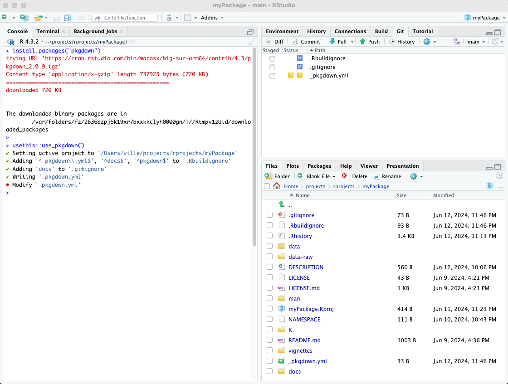
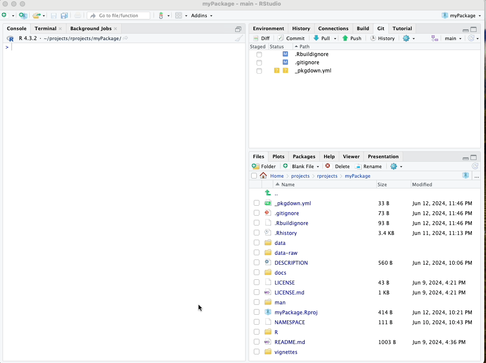
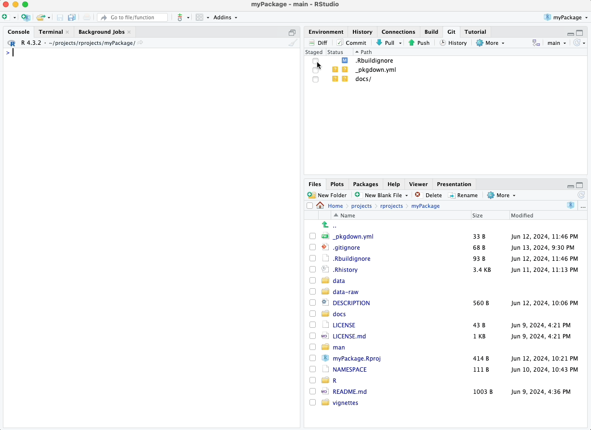
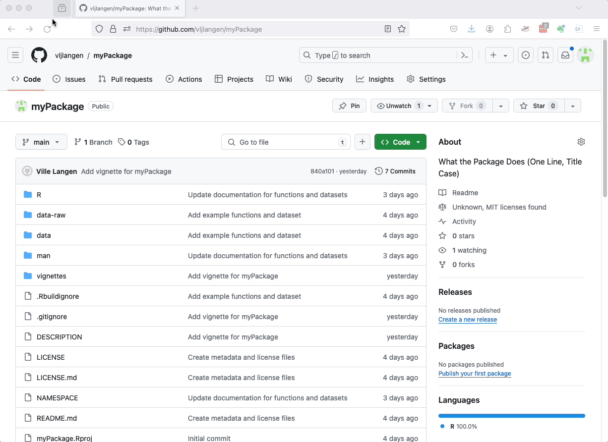
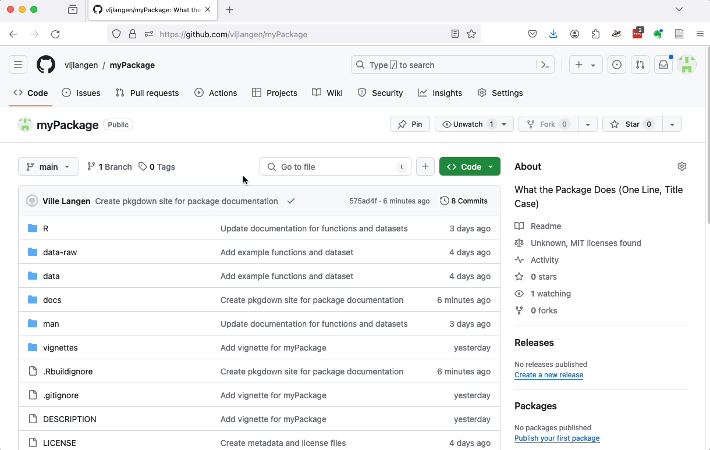
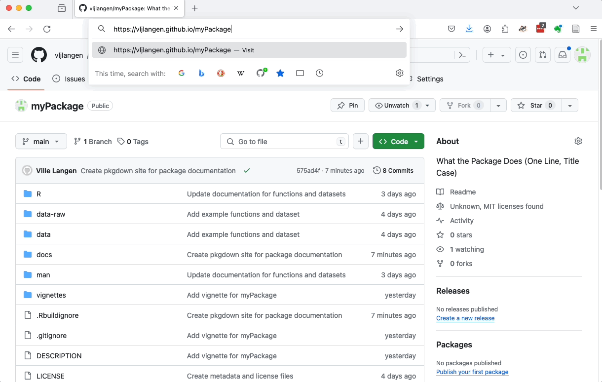
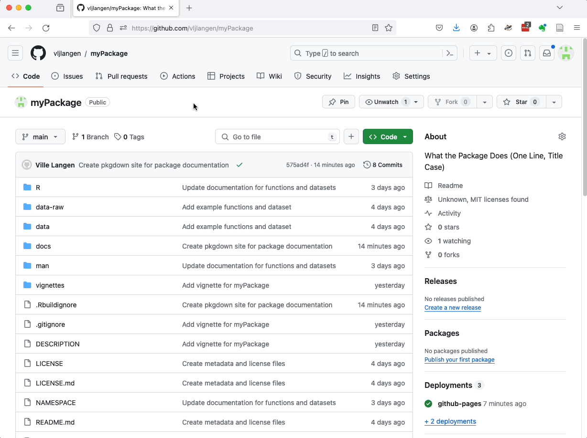

# Building a Website with pkgdown

Every decent package deserves a decent website. In this chapter, we'll
explore how to use **pkgdown** to generate a comprehensive website for
your R package. This website will include documentation, vignettes,
function references, and more, making it easier for users and
collaborators to explore and understand your package.

## Using pkgdown

To create a website for your package using **pkgdown**, follow these
simple steps:

1.  **Install pkgdown**: If you haven't already installed **pkgdown**,
    you can do so using the following command:

``` r
install.packages("pkgdown")
```

2.  **Streamline setup**: Ensure your package is configured correctly
    for website generation by using `usethis::use_pkgdown()`:

``` r
usethis::use_pkgdown()
```

This command sets up the necessary infrastructure within your package to
enable **pkgdown** to build the website seamlessly.

Please see the screenshot of these commands below.

\



\

3.  **Generate the website**: Run the following command to generate the
    website:

``` r
pkgdown::build_site()
```

This command compiles all the necessary documentation and vignettes into
HTML files and organizes them into a structured website format.

4.  **View the website:** After running `pkgdown::build_site()`, the
    generated site will open automatically in your web browser. You can
    also preview it locally by opening the `docs/index.html` file in any
    web browser.

Please see the video of these steps below.

\


\

## Correcting .gitignore

Before publishing your web page online, you'll need to take one more
step: removing `docs` from `.gitignore`.

By default, `usethis::use_pkgdown()` adds the `docs` directory to your
`.gitignore` file. This prevents GitHub from recognizing and deploying
your website files. To rectify this, you'll need to remove the `docs`
entry from `.gitignore`.

-   Open the `.gitignore` file located in your package directory.
-   Delete the line that says `docs/`.
-   Save the `.gitignore` file.

Removing `docs` from `.gitignore` ensures that GitHub will include the
`docs` directory when you push your changes.

Removing `docs` from `.gitignore` ensures that GitHub will include the
docs directory when you push your changes. Please refer to the video
below.

\



\

## GitHub Pages Hosting

One of the easiest ways to host your package website is using GitHub
Pages. Here’s how you can do it:

1.  **Push changes to GitHub**: Make sure all your changes, including
    the generated `docs/` folder from **pkgdown**, are committed and
    pushed to your GitHub repository.

\



\



\

2.  **Configure GitHub Pages**:

-   Go to your GitHub repository on the web.
-   Navigate to the "Settings" tab.
-   Scroll down to the "GitHub Pages" section.
-   In the "Source" drop-down menu, select "main" or "master" branch
    depending on your default branch.
-   Select `/docs` as the folder source.
-   Click on "Save".

\



\

3.  **Access your website**: After saving, GitHub Pages will publish
    your package website at `https://username.github.io/repo`, where
    `username` is your GitHub username and `repo` is the name of your
    repository.

\



\

An alternative way to access your website is to click on the "Deployments - github-pages" section on the right margin of your GitHub repository and then click on "github-pages".

\




\

---

In the next chapter, we'll conclude by wrapping up what we've learned in this tutorial.

\

\

\

<p xmlns:cc="http://creativecommons.org/ns#" xmlns:dct="http://purl.org/dc/terms/">

<a property="dct:title" rel="cc:attributionURL" href="https://creating-r-packages.netlify.app">Creating
R Packages: A Step-by-Step Guide</a> by
<a rel="cc:attributionURL dct:creator" property="cc:attributionName" href="https://www.linkedin.com/in/ville-langen/">Ville
Langén</a> is licensed under
<a href="https://creativecommons.org/licenses/by-sa/4.0/?ref=chooser-v1" target="_blank" rel="license noopener noreferrer" style="display:inline-block;">CC
BY-SA
4.0</a>

</p>
